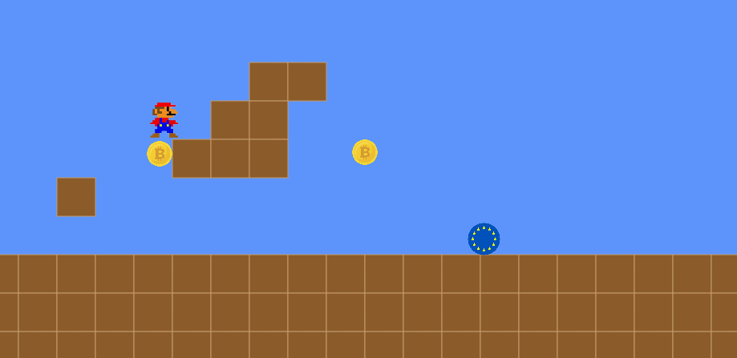

This is an ai-generated mario game created with RooCode, using optimus-alpha from openrouter.

demo: https://pcdr.cz/ai_games/Ai-Mario/ (test levels only..)

level editor:  https://pcdr.cz/ai_games/Ai-Mario/editor.html (by gpt-4o)



ai devs fb group: https://www.facebook.com/groups/ai.vyvojari


#### Used prompts:

The first commit is the result of the four prompts listed below. I will add more prompts after completion.

#### Prompt 1
```
Create a responsive JavaScript-based platformer game inspired by Super Mario.

Requirements:

    Core Gameplay:

        Classic 2D side-scrolling mechanics (run, jump, collide with enemies, collect coins).

        Simple physics (gravity, jump acceleration, platform collisions).

        Keyboard controls for movement and jumping.

        Basic enemy AI (e.g., Goomba-like creatures walking back and forth).

    Level/Map System:

        Levels must be defined in external files, stored in a way that makes it easy to create, edit, and add new levels later (e.g., JSON or another structured format).

        Each level file should contain tile layout, enemy and item positions, start/goal locations, etc.

        There should be a system to load and switch levels dynamically at runtime.

    Responsiveness:

        The game should be responsive and adapt to various screen sizes.

        Set reasonable boundaries for minimum and maximum display sizes to maintain playability (e.g., min 800x600, max 1920x1080).

        Maintain proper scaling of graphics and controls across devices (desktop, tablet, modern mobile browsers).

    Modularity and Extensibility:

        The codebase should be modular (e.g., separate files/modules for game loop, rendering, input, level loading).

        Easy to extend with new features like power-ups, different enemies, animations, etc.

    Optional but Nice to Have:

        Use an HTML5 <canvas> for rendering.

        Basic sound effects (jump, coin, enemy defeat).

        Simple HUD (score, lives, level number).

Make sure the initial version includes at least one playable level to demonstrate the full functionality.
```


#### Prompt 2
```
When the player jumps on an enemy from above, the enemy is "eaten" (removed from the game), and the player gains +1 point.
```


#### Prompt 3
```
Currently, when the level is wider than the visible screen, Mario can walk off-screen without the camera following him.

Expected behavior:

    Implement horizontal camera scrolling that follows Mario as he moves left and right across a wide level.

    Mario should always remain within the visible viewport, ideally centered or slightly offset forward in the direction of movement.

    The camera should not scroll past the level boundaries (e.g. it shouldn't show empty space beyond the end of the map).

    Smooth scrolling is preferred (not snapping).
```


#### Prompt 4
```
Update the rendering system to support PNG images (sprites) for all entities: Player, Enemy, and Coin.

Details:

    Each entity should be rendered using an external PNG image instead of basic shapes or colors.

    Player and Enemy must support directional sprites:

        Allow specifying up to 4 separate image files, corresponding to movement directions:

            left, right, up, down (or at minimum left and right).

        When an entity moves, the correct directional sprite should be displayed.

        If an entity is stationary, it may show the last used direction or a default "idle" image.

    Coin can use a single static PNG image (no animation needed).

    Add fallback handling: if a directional image is missing, fall back to a default sprite.

    Support loading all sprites from a central config (e.g., JSON or similar structure), with file paths for each direction per entity.
```